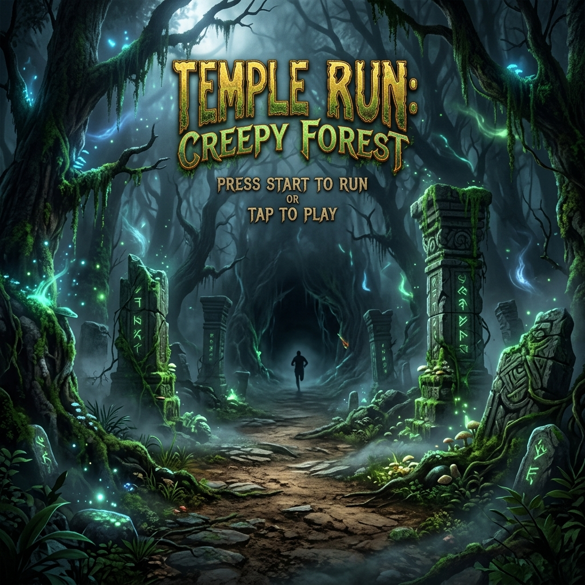

<div align="center">
  

  # 🏃 Temple Run: Cursed Forest 🌲

  **A real-time hand-gesture controlled 3D endless runner game built with MediaPipe, Three.js WebGL, and Vibe Coding.**

  [](https://google.github.io/mediapipe/solutions/hands.html)
  [](https://threejs.org/)
  [](https://developer.mozilla.org/en-US/docs/Web/HTML/Element/canvas)
  [](https://developer.mozilla.org/en-US/docs/Web/JavaScript)
  [](#-boldly-built-with-vibe-coding)

</div>

---

## 🔮 Boldly Built with Vibe Coding

> [!IMPORTANT]
> **This entire codebase was built using the revolutionary paradigm of VIBE CODING!** 🚀
> 
> *Vibe Coding* represents a monumental shift in software creation. Rather than getting bogged down in boilerplate, syntactical micro-decisions, and manual implementation loops, the creator **steered the vision, aesthetics, and game mechanics (the "Vibe")** while partnering closely with an advanced AI coding assistant to dynamically design, compile, and deploy a production-grade 3D WebGL game engine in record time.
> 
> By focusing entirely on premium gameplay feelings, visual atmosphere, immersive audio design, and real-time computer vision controls, we turned ideas into high-fidelity code at the speed of thought. **This is software development at the speed of imagination.** ✨

---

## 🎮 Play the Game Live

The game is deployed and fully accessible on multiple premium cloud platforms:

*   ⚡ **Netlify Production**: [rainbow-kelpie-d8ebe2.netlify.app](https://rainbow-kelpie-d8ebe2.netlify.app)
*   🚀 **Vercel Production**: [temple-run-game-rouge.vercel.app](https://temple-run-game-rouge.vercel.app)

---

Paradigm: Vibe Coding
*   **AI Agent Pair Programming**: Built from start to finish via **Vibe Coding**—where the developer defines high-level design specifications, aesthetic patterns, and system guidelines, while the AI Agent translates these guidelines into flawless architectural blocks. This drastically cut down standard boilerplate timelines and maximized visual optimization, demonstrating the modern peak of software craftsmanship.

---

## 🕹️ Control Systems & Gestures

Show your hand to the camera to keep the running speed active. Hide your hand or step away to decelerate the character immediately.

| Gesture | In-Game Action | Mechanics |
| :--- | :--- | :--- |
| **Hand Left** (X-axis < 0.35) | **Switch to Left Lane** | Smooth horizontal position interpolation |
| **Hand Right** (X-axis > 0.65) | **Switch to Right Lane** | Smooth horizontal position interpolation |
| **Peace Sign (✌️)** | **High Jump** | Index & middle fingers extended, others folded |
| **Closed Fist (✊)** | **Under Slide** | All 4 primary fingers folded down |
| **Hand Visible** | **Sprint Forward** | Decelerates automatically if no hand is detected |

---

## 📂 Project Architecture

```
temple-run/
├── index.html        # Glassmorphic HUD overlay, webcam controls, loading gates
├── style.css         # AAA game styles, custom animations, camera overlays
├── main.js           # Three.js 3D pipeline, MediaPipe tracking loop, game rules
├── audio.js          # Web Audio API synthesizers and ambient LFO engines
├── netlify.toml      # Build path rules for Netlify CDN
├── .vercel/          # Vercel deployment credentials
└── assets/           # Splash screens, background images, and base maps
```

---

## 🚀 Running the Project Locally

Since the game is a modular, zero-dependency vanilla web app, you can run it instantly using any simple static file server:

1.  **Clone the Repository**:
    ```bash
    git clone https://github.com/AbhayPotle/TEMPLE-RUN-GAME-.git
    cd TEMPLE-RUN-GAME-
    ```
2.  **Serve Locally**:
    Use any standard HTTP server (like Python, Node, or VS Code Live Server):
    ```bash
    # Node.js
    npx serve .
    
    # Python 3
    python -m http.server 8000
    ```
3.  **Open in Browser**:
    Navigate to `http://localhost:3000` (or `http://localhost:8000`) and grant webcam permission!

---

## 📝 License
Distributed under the MIT License. Developed with passion, vibes, and artificial intelligence.
