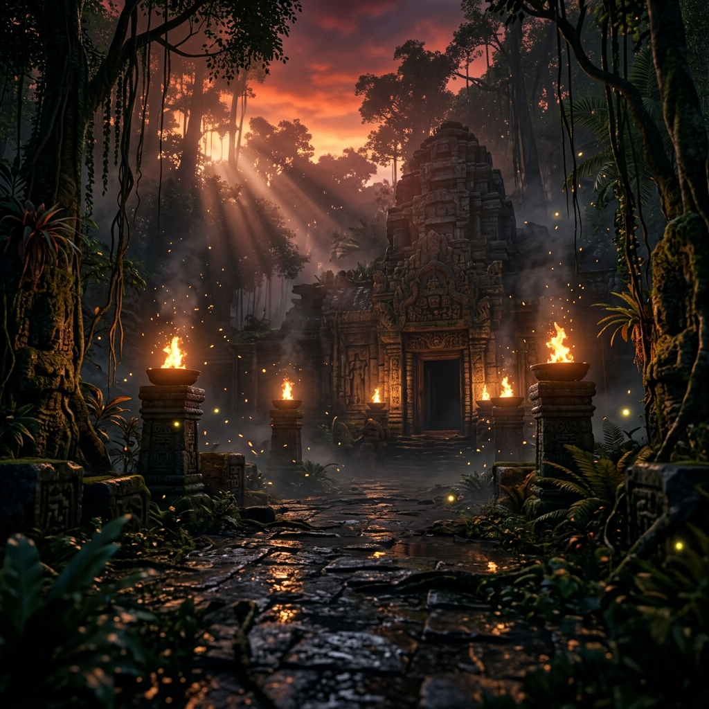
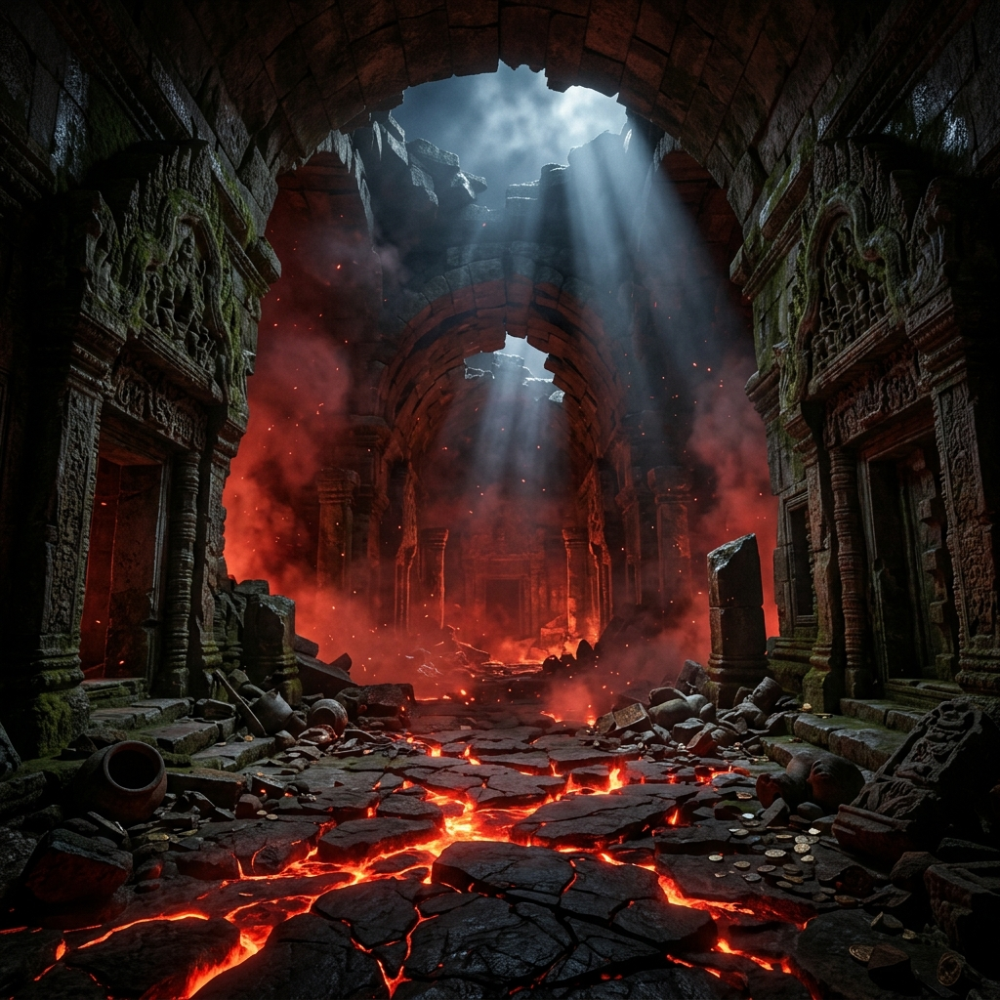

# 🏃 Temple Run: Cursed Forest

> **An AI-powered 3D endless runner game with real-time hand gesture controls**



## 🎮 Play Now
**🔗 [Play the Game Live](https://rainbow-kelpie-d8ebe2.netlify.app)**

## 🌟 Features

### 🤖 AI Computer Vision
- Real-time **hand tracking** using MediaPipe
- Gesture detection for movement, jumping, and sliding
- Live webcam feed overlay showing AI detection points

### 🎨 AAA-Quality Graphics
- **3D Creepy Forest** environment with Three.js
- Dynamic fog and volumetric lighting
- Procedurally generated trees and obstacles
- Floating particle effects (embers/dust)
- Camera shake and dynamic FOV effects

### 👹 Chase Monster AI
- A glowing demon entity chases you from behind
- Red atmospheric lighting follows the monster
- Monster growl sound effects

### 🏆 Gameplay Mechanics
- **3 Lane System** — Move hand left/right to switch lanes
- **Jump** — Raise hand high to jump over obstacles
- **Slide** — Lower hand to slide under barriers
- **Coins** — Collect spinning golden coins for points
- **Near Miss Combo System** — Dodge obstacles closely for bonus points
- **Progressive Difficulty** — Speed increases over time

### 🔊 Immersive Audio
- Synthesized sound effects (jump, slide, crash, coin, monster growl)
- Ambient creepy wind atmosphere
- Near-miss alert sounds

### 🎬 Cinematic Experience
- Animated loading screen
- Story intro sequence
- Game over stats dashboard
- Glassmorphism UI design

## 🕹️ How to Play

1. **Allow camera access** when prompted
2. **Show your hand** to the webcam
3. Use gestures to control:
   | Gesture | Action |
   |---------|--------|
   | Hand Left | Move Left Lane |
   | Hand Right | Move Right Lane |
   | Hand Up | Jump |
   | Hand Down | Slide |
   | Hand Visible | Run Forward |
   | Hand Hidden | Slow Down |

## 🛠️ Tech Stack
- **Three.js** — 3D Graphics Engine
- **MediaPipe Hands** — AI Hand Tracking
- **Web Audio API** — Sound Synthesis
- **Vanilla JS/CSS** — Game Logic & UI

## 📸 Screenshots

### Start Screen


### Game Over


## 🚀 Run Locally
```bash
# Clone the repo
git clone https://github.com/AbhayPotle/TEMPLE-RUN-GAME-.git

# Serve with any HTTP server
npx serve .
```

## 📝 License
MIT License